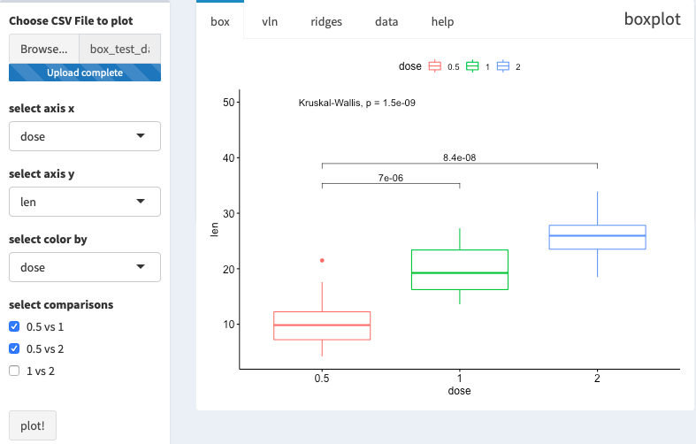
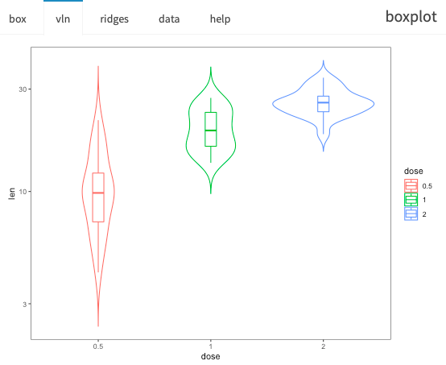
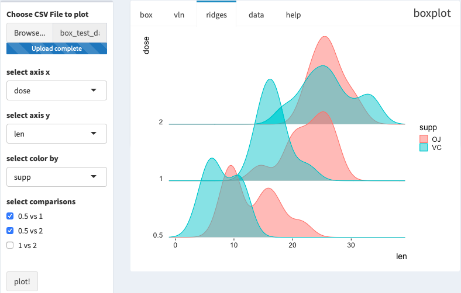
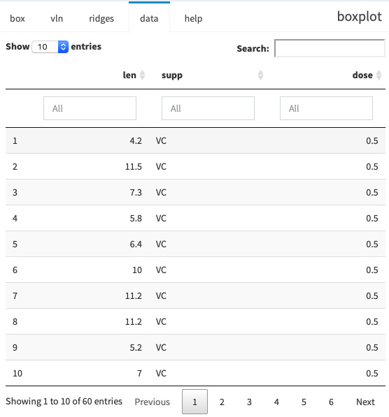

## boxplot
输入数据为csv格式，逗号分隔，文件名以`.csv`结尾

[数据示例](https://raw.githubusercontent.com/seqyuan/baseplot/master/boxplot/box_test_data.csv)


```
"len","supp","dose"
4.2,"VC","0.5"
11.5,"VC","0.5"
7.3,"VC","0.5"
5.8,"VC","0.5"
6.4,"VC","0.5"
10,"VC","0.5"
11.2,"VC","0.5"
11.2,"VC","0.5"
5.2,"VC","0.5"
```

### 结果展示




