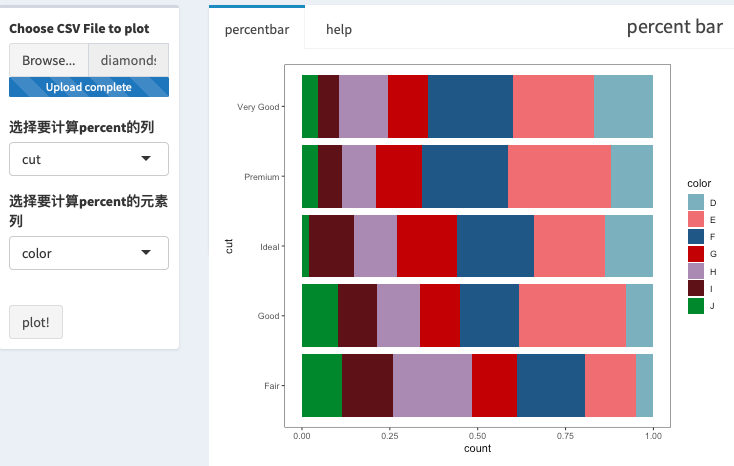

# 输入数据格式
输入数据为csv格式，逗号分隔，文件名以`.csv`结尾

[数据示例](https://raw.githubusercontent.com/seqyuan/baseplot/master/percent_bar/diamonds.csv)
```
"","carat","cut","color","clarity","depth","table","price","x","y","z"
"1",0.23,"Ideal","E","SI2",61.5,55,326,3.95,3.98,2.43
"2",0.21,"Premium","E","SI1",59.8,61,326,3.89,3.84,2.31
"3",0.23,"Good","E","VS1",56.9,65,327,4.05,4.07,2.31
"4",0.29,"Premium","I","VS2",62.4,58,334,4.2,4.23,2.63
"5",0.31,"Good","J","SI2",63.3,58,335,4.34,4.35,2.75
"6",0.24,"Very Good","J","VVS2",62.8,57,336,3.94,3.96,2.48
"7",0.24,"Very Good","I","VVS1",62.3,57,336,3.95,3.98,2.47
"8",0.26,"Very Good","H","SI1",61.9,55,337,4.07,4.11,2.53
"9",0.22,"Fair","E","VS2",65.1,61,337,3.87,3.78,2.49
```

### 结果展示

